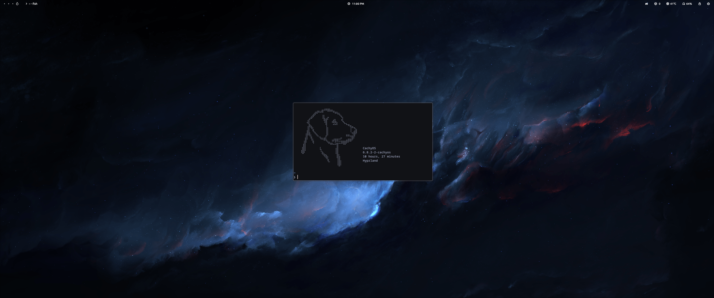

# dotfiles
 My dotfiles for hyprland
 
 - Distro: CachyOS
 - WM: Hyprland
 - Shell: Fish
 - Terminal: Kitty
 - Panel: Waybar
 - Launcher: Wofi
 - File Manager: Nemo
   

# Noteable Keybinds

- Mod + Shift, I - set corsair aio to quiet
- Mod + Shift, O - set corsair aio to balanced
- Mod + Shift, P - set corsair aio to extreme
> requires liquidctl & aio.sh to be placed in /opt/aio
